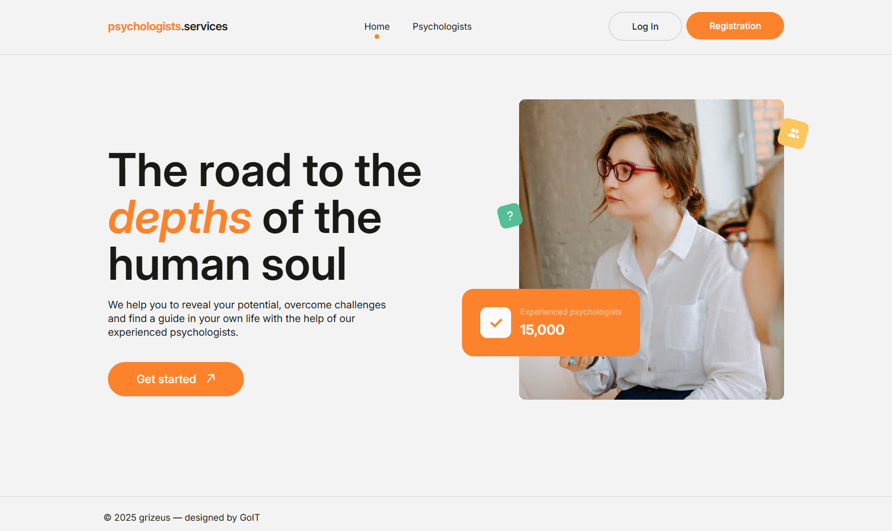

# Psychologists Services - Web Application [Live demo](psychologists-services-psi.vercel.app/) 


## [**Mockup**](https://www.figma.com/file/I5vjNb0NsJOpQRnRpMloSY/Psychologists.Services?type=design&node-id=0-1&mode=design&t=4zfT2zFANRbp1fCK-0)

## [**Technical Task**](https://docs.google.com/document/d/1PrTxBn6HQbb0Oz17g5_zvyLGIOZg0TIP3HPaEEp6ZLs/edit?tab=t.0)

## Project Description

This application is designed for a company that offers the services of psychologists. It consists of three main pages: a homepage, a page listing psychologists, and a private "Favorites" page for authorized users. The application allows users to browse psychologist profiles, sort them by various criteria, add them to a favorites list (after authorization), and submit appointment requests.

## Features

- 🏠 **Home Page:** Welcome screen with key information and quick access to the psychologists list.
- 📝 **Psychologists Page:** Browse the full list of available psychologists.
- ❤️ **Favorites Page:** View and manage your favorite psychologists.

## Main Technologies

* **React:** A JavaScript library for building user interfaces.
* **React Router:** For implementing navigation between pages.
* **Zustand:** For managing the application state.
* **Firebase:**
    * **Firebase Authentication:** For implementing authorization functionality (registration, login, fetching current user data, logout).
    * **Firebase Firestore Database:** For storing data about psychologists and (optionally) user's favorite lists.
* **react-hook-form:** For creating and validating registration/login and consultation request forms.
* **yup:** A library for schema-based validation.
* **HTML5:** For page structure.
* **Tailwind CSS and CSS Modules:** For styling the application.
* **JavaScript (ES6+):** The primary programming language.
* **Vite:** For bundling the project.

## Installation

To set up the project locally, ensure you have one of the following package managers installed: **npm**, **yarn**, **deno**, or **bun**.

### Steps

1. Clone the repository:
    ```bash
    git clone https://github.com/grizeus/psychologists-services.git
    ```
2. Navigate to the project directory:
    ```bash
    cd car_rental
    ```
3. Install dependencies (using npm as an example):
    ```bash
    npm install
    ```
4. Run the development server:
    ```bash
    npm run dev
    ```

## Usage

After running the development server, open your browser and visit:
http://localhost:5173/

Explore the homepage, browse the catalog, and try renting a car to see the app in action.

---

## About the Author

**Petro Zaitsev**  
_GitHub_: [grizeus](https://github.com/grizeus)  

As a dedicated front-end developer with a passion for innovation, I'm excited to connect with like-minded professionals in the tech industry. With expertise in **HTML5, CSS3/SASS, JavaScript/TypeScript, Tailwind, React**, and more, I bring digital projects to life through clean code and thoughtful design. When I'm not coding, I’m learning new technologies and collaborating with driven teams to deliver high-quality results.

---

🚀 **Let’s build something great together!**